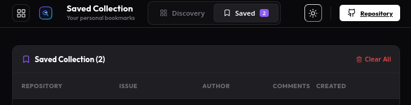

# Open Issue Finder

A production-grade discovery tool for finding beginner-friendly open-source issues. Built with performance, accessibility, and developer experience in mind.

Live: https://kanyingidickson-dev.github.io/Open-Issue-Finder/

## Why this exists

Finding a first meaningful OSS contribution is harder than it should be.

Open Issue Finder exists to:

- make it fast to discover real issues you can contribute to
- reduce the friction of GitHub search syntax
- help you prioritize repos that look actively maintained

## Demo


## Screenshots




## Features

- **Real-time Discovery**: Directly interfaces with the GitHub API to find the latest issues.
- **Smart Filtering**: Filter by language, normalized labels (e.g., `beginner`, `help_wanted`), sort order, and issue state.
- **Saved Collections**: Bookmark interesting issues locally to review or tackle later.
- **Saved Searches**: Save/share filter presets (URL-synced) to revisit common searches.
- **Repo Health Score**: A lightweight, cached heuristic to help you prioritize active repositories.
- **View Modes**: Switch between "Discovery" mode and your "Saved Collection".
- **Keyboard Shortcuts**: Power-user friendly with shortcuts (`d` for Discovery, `s` for Saved, `t` for theme toggle, `/` for search).
- **Premium UI/UX**: Dark-mode first design with glassmorphism aesthetics, smooth transitions, and toast notifications.
- **Responsive Design**: Fully optimized for mobile, tablet, and desktop viewing.

## Tech Stack

- **Framework**: [React](https://reactjs.org/) + [Vite](https://vitejs.dev/)
- **Styling**: [Vanilla CSS](https://developer.mozilla.org/en-US/docs/Web/CSS) (using modern CSS variables and glassmorphism)
- **Icons**: [Lucide React](https://lucide.dev/)
- **API**: [@octokit/rest](https://github.com/octokit/rest.js/)
- **Language**: [TypeScript](https://www.typescriptlang.org/)

## Getting Started

### Prerequisites

- Node.js (v18 or higher)
- npm or yarn

### Installation

1. Clone the repository:
   ```bash
   git clone git@github.com:kanyingidickson-dev/Open-Issue-Finder.git
   ```

2. Install dependencies:
   ```bash
   npm install
   ```

3. (Optional) Set up a GitHub Personal Access Token for higher rate limits:
   Create a `.env` file in the root directory:
   ```env
   VITE_GITHUB_TOKEN=your_token_here
   ```

4. Start the development server:
   ```bash
   npm run dev
   ```

## Contributing

Contributions are welcome! Please see [CONTRIBUTING.md](CONTRIBUTING.md).

## License

This project is licensed under the MIT License - see the [LICENSE](LICENSE) file for details.
